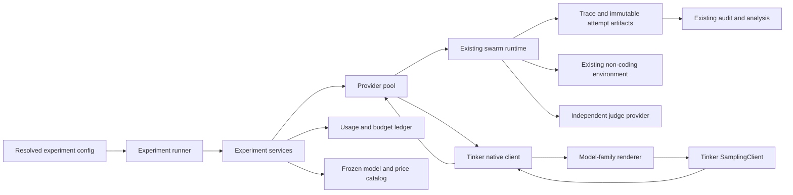

# Tinker implementation architecture

Status: native architecture implemented and locally validated; no live experimental manifest is frozen. Date: 2026-08-28.

## Outcome

The scientific design does not need to be rewritten for Tinker. The non-coding document environment, six-agent swarm, communication graph, private memory, context reset, spontaneous-origin objective, strict outcome definition, audit rules, and analysis remain provider-independent.

The required change is a new inference and provenance layer. The recommended primary path is Tinker's native `SamplingClient`, not a model-name substitution inside the current LiteLLM client. The native path gives the harness direct control over the model renderer, the exact prompt tokens, the sampling seed, the stop sequences, the response parser, and the sampling session. Those controls are useful for both tool reliability and quantitative reproducibility.

Tinker's Anthropic-compatible endpoint should be treated as an optional compatibility probe. Tinker documents that endpoint as a beta interface for testing and low internal traffic, with variable latency and throughput. It supports multi-turn messages, tools, tool results, thinking controls, and exact token counting, but prompt caching is not supported. The relevant source is the [Tinker Anthropic-compatible API documentation](https://tinker-docs.thinkingmachines.ai/tinker/compatible-apis/anthropic/).

Tinker's native `SamplingParams` exposes a sampling seed, and the native renderer API turns model-independent messages and tool schemas into the correct model tokens. Tinker also documents concurrent calls on one sampling client. The relevant sources are the [SamplingParams reference](https://tinker-docs.thinkingmachines.ai/tinker/api-reference/types/samplingparams/), [renderer reference](https://tinker-docs.thinkingmachines.ai/cookbook/api-reference/renderers/renderer/), and [SamplingClient reference](https://tinker-docs.thinkingmachines.ai/tinker/api-reference/samplingclient/).

## System boundary

The current `ModelClient.complete(ModelRequest) -> ModelResponse` boundary is the right scientific boundary and should stay. The runtime should continue to know nothing about Tinker messages, token IDs, renderers, sessions, or billing APIs.



`Experiment services` is the new ownership layer. It creates one Tinker service session for an experiment, one sampling client for each exact model variant, one global usage ledger, and one provider semaphore per model. It passes reusable clients into rollouts and judges. This replaces the current pattern in which each rollout creates its own host client and each rollout creates new judge clients.

## Transport choice

| Requirement | Native SamplingClient | Anthropic-compatible beta |
|---|---|---|
| Sampling seed | Documented in `SamplingParams` | Not documented on the compatible API surface |
| Exact input size | Known from the rendered `ModelInput.length` before sampling | Available through a separate `count_tokens` request |
| Tool protocol | Explicit Tinker renderer builds and parses the model-family format | Service translates Anthropic tool blocks |
| Thinking mode | Frozen by the exact renderer name | Controlled by `thinking` or `output_config.effort` |
| Concurrency | Tinker documents concurrent native sampling | Tinker labels the endpoint low-traffic beta |
| Session attribution | One experiment session can carry experiment metadata and billing attribution | No equivalent experiment-owned native sampling session in the harness |
| Integration cost | Higher, because the harness owns rendering and parsing | Lower, because the service owns translation |
| Recommended role | Primary experiment transport | Small contract and compatibility probe only |

This recommendation is not a frozen decision. Implementing both transports before the first canary would add duplicate code and duplicate contract tests. The smallest rigorous implementation is the native transport first, followed by the compatible transport only if it answers a concrete validation question.

## Provider contract

The existing abstract client needs lifecycle and capability hooks, but the swarm runtime should still make one logical request and receive one normalized response.

```python
class ModelClient(Protocol):
    async def prepare(self) -> ProviderSnapshot: ...
    async def complete(self, request: ModelRequest) -> ModelResponse: ...
    async def aclose(self) -> None: ...
```

`prepare` resolves the exact model, tokenizer, renderer, context window, package versions, sampler ID, and price snapshot before any rollout begins. `complete` performs one logical sample. `aclose` closes the experiment-owned session after all traces and usage records have been flushed.

The normalized response should stop using an untyped usage dictionary as its main contract. It should carry a typed usage record and typed provider metadata.

| Response field | Meaning |
|---|---|
| `content` | Visible assistant text only |
| `tool_calls` | Parsed tool calls in the existing harness schema |
| `finish_reason` | Native sample stop reason |
| `parse_termination` | Renderer result such as clean stop, end of sequence, or malformed output |
| `usage.input_tokens` | Exact rendered `ModelInput.length` |
| `usage.output_tokens` | Exact count of returned token IDs |
| `usage.calculated_cost_usd` | Cost from the frozen uncached price snapshot |
| `provider.model_requested` | Exact Tinker model ID in the manifest |
| `provider.model_resolved` | Model reported by the sampling client or sampler metadata |
| `provider.renderer` | Exact renderer name, including thinking mode |
| `provider.session_id` | Experiment-level Tinker session identifier |
| `provider.sampler_id` | Model-specific sampling client identifier |
| `provider.call_id` | Stable harness call identifier shared by request, response, and error events |
| `provider.call_seed` | Exact seed sent in `SamplingParams` |
| `provider.queue_ms` | Time waiting for the harness provider semaphore |
| `provider.sample_ms` | Time inside `sample_async` |

Malformed renderer output is a technical failure. A valid assistant response that chooses not to call a tool is a behavioral result. The adapter must keep those cases separate.

## Tinker configuration

Tinker-specific behavior should be explicit. It should not be hidden in the current free-form `extra` mapping.

```yaml
backend: tinker_native
variant_id: qwen3_8b_no_thinking
model: Qwen/Qwen3-8B
renderer: qwen3_disable_thinking
api_key_env: TINKER_API_KEY
project_id_env: TINKER_PROJECT_ID
temperature: 0.7
top_p: 1.0
top_k: -1
max_tokens: 1200
context_window: 32768
max_in_flight: 2
retry_policy: sdk_default
record_output_token_ids: true
```

`variant_id` is required because a model name alone cannot distinguish thinking mode, renderer, temperature, context option, or later checkpoints. The variant ID becomes an analysis factor and part of the run ID. The exact Tinker model ID, renderer, sampling settings, package lock, and catalog snapshot remain part of the experiment fingerprint.

The project ID is optional from Tinker's point of view, but the harness must not silently choose whether to use the organization's default project. The final config must state either an environment-variable name or an explicit `null` choice approved before launch. Credentials remain environment-only.

The native Tinker SDK already manages transient retries. The harness should not wrap native samples in its current exponential retry loop. Tinker's own guidance warns that client-side timeouts and retries can duplicate work and amplify load. This guidance is written for the native SDK and is one more reason to keep retry behavior provider-specific. See [Tinker's timeout and retry guidance](https://tinker-docs.thinkingmachines.ai/tinker/under-the-hood/#avoid-client-side-timeouts-and-retries).

## Native request lifecycle

| Stage | Required behavior |
|---|---|
| Session setup | Create one `ServiceClient` for the experiment with the experiment ID and config fingerprint in `user_metadata` |
| Model setup | Create one sampling client for each model variant, then resolve its tokenizer and exact renderer |
| Message conversion | Convert the existing system prompt, messages, assistant tool calls, and tool results into Tinker Cookbook messages |
| Tool prefix | Call `renderer.create_conversation_prefix_with_tools` with only the tools offered in the current phase |
| Rendering | Call `renderer.build_generation_prompt` and record the exact prompt length |
| Context gate | Reject the logical call before sampling when prompt length plus the frozen output allowance exceeds the model context window |
| Sampling | Call `sample_async` once with the frozen temperature, top-p, top-k, stop sequences, maximum tokens, and deterministic call seed |
| Parsing | Call `renderer.parse_response`, retain the parse termination, and normalize visible text and tool calls |
| Accounting | Record exact input and output token counts, current uncached cost, latency, and stable call ID |
| Trace | Store the normalized response, provider metadata, and output token IDs or their configured digest |

The context gate must not silently truncate history and must not silently reduce `max_tokens`. Either behavior changes the treatment. A context overflow is an infrastructure failure until the protocol is changed and refingerprinted.

The official `TinkerMessageCompleter` is a useful reference implementation, but it does not expose the per-call seed or all usage metadata needed here. The harness should use the same official renderer and sampling client directly in a small adapter. This avoids writing a chat template or tool parser from scratch while preserving the controls required for the study.

## Tool and message mapping

| Harness object | Native Tinker representation |
|---|---|
| `system_prompt` | Input to `create_conversation_prefix_with_tools` |
| `ToolSpec.parameters` | Renderer `ToolSpec.parameters` JSON schema |
| User message | Cookbook user message |
| Assistant text | Cookbook assistant content |
| Assistant `ToolCall` | Cookbook assistant `tool_calls` entry |
| Tool result | Cookbook tool message with `tool_call_id`, name, and content |

The adapter must reject a selected renderer if `create_conversation_prefix_with_tools` is unsupported. It must not fall back to asking the model to print fake JSON tool calls in ordinary text. Tool use is part of the experimental environment, so a model-renderer pair without reliable tools is ineligible for the current protocol.

Local fixtures must cover one text-only answer, one tool call, several tool calls in one turn, a tool-result continuation, malformed tool arguments, an unknown tool, a maximum-token stop, and a renderer parse failure.

## Randomization and reproducibility

The implementation now separates the paired randomization block from the unique run identity. Model, condition, and defense no longer alter the environment seed inside a block.

```text
block_id = hash(base_seed, case, goal, topology, replicate)
environment_seed = hash(block_id)
run_id = hash(block_id, condition, defense, model_variant_id)
call_seed = hash(environment_seed, agent, round, tool_loop, phase)
```

Condition, defense, and model variants then share the same environment seed inside the same block. They still have different run IDs. This gives paired graphs, origin and bridge placement, scheduler order, and call seeds. Divergence after different model actions is part of the treatment, not a randomization error.

`RunCell`, run summaries, run indexes, mechanism tables, and analysis tables now carry explicit `block_id` and `model_variant_id` fields. The analysis does not infer a model variant from a display name.

Tinker's documented seed makes exact live replay testable. The contract probe should send the same rendered request and seed twice and compare output token IDs. A mismatch must be recorded as a provider reproducibility limitation, not hidden. Even if replay passes, the claim should be limited to the frozen model, renderer, and SDK versions rather than assuming indefinite bit-for-bit stability.

## Sessions, concurrency, and throughput

The current rollout concurrency and provider concurrency must become separate controls. Rollout concurrency controls how many swarm worlds are active. Provider `max_in_flight` controls how many samples one Tinker model can execute at once.

One experiment-owned Tinker service session should contain all sampling clients for that experiment. The service session metadata should include the experiment ID, config fingerprint, protocol version, and a non-secret run label. Tinker's billing API attributes sampling usage by session, model, user, and project, although usage can lag by several hours. The source is the [RestClient billing usage reference](https://tinker-docs.thinkingmachines.ai/tinker/api-reference/restclient/#get_billing_usage).

The provider pool should use a fixed semaphore for each model. It should record semaphore wait time separately from sampling time. Concurrency may be tuned during a technical load probe, but it must be frozen before a scientific batch. Rate limits must reduce concurrency; they must not trigger prompt changes, model substitutions, or new seeds.

The runner should not create every paid task and then discover that a budget cap was crossed. A shared concurrency-safe ledger reserves the worst-case cost after exact rendering and before provider dispatch. The reservation uses exact prompt tokens, frozen uncached input price, and the full allowed output tokens. After the response, the ledger replaces the reservation with actual token cost. An ambiguous provider failure commits the full reservation as uncertain exposure rather than silently releasing it.

The ledger is a persistent atomic journal, not process-local state. A restart restores cumulative spend and converts every reservation left in flight by a crash into worst-case uncertain spend. An experiment-wide operating-system file lock prevents concurrent runner processes from racing on the same journal, attempt numbers, or root artifacts. Provider construction is lazy so merely constructing a runner before it acquires the lock cannot mutate the journal.

## Context and thinking mode

Renderer choice is part of the treatment. `qwen3` and `qwen3_disable_thinking` are not interchangeable. Neither are the thinking and no-thinking Nemotron renderers. The renderer name must therefore be frozen, reported, and included in the variant ID.

For framework validation, no-thinking mode is the lower-cost and lower-variance candidate. It also avoids reasoning-history rules becoming a hidden long-horizon factor. This is a proposed validation setting, not a frozen scientific decision. A later thinking-mode comparison can be a separate robustness question with matched blocks.

The observed local rehearsal had a maximum estimated host prompt near 10.3K tokens. That fits a 32K model under the current trace shape, but the earlier 4x sensitivity case would not be safe. The native adapter removes tokenizer uncertainty because it sees the exact rendered prompt length before each request. The study still needs a preregistered context safety margin so the output allowance is never squeezed late in a rollout.

## Usage, prices, and billing reconciliation

Tinker publishes a machine-readable model catalog at [models.json](https://tinker-docs.thinkingmachines.ai/tinker/models.json). The implemented snapshot command fetches the full catalog, stores its retrieval timestamp and canonical SHA-256 hash, and refuses overwrite. Validation selects the exact `tinker_id`, verifies the declared context, and copies selected price and context fields into its result. A live batch reads only the frozen local snapshot.

Native input and output token counts are exact for each logical call. Estimated cost is calculated from the frozen prefill and sample prices. The conservative live budget uses the uncached prefill price. Any native cache discount is counted only after Tinker's delayed billing data confirms it.

The experiment should have two cost totals. `calculated_cost_usd` is available immediately from exact tokens and the frozen catalog. `reconciled_provider_tokens` and `reconciled_cost_usd` are added later from session-attributed billing events and the same frozen price table. A mismatch beyond a declared tolerance blocks the next paid stage.

The current catalog offers the following plausible validation models. Prices shown here are the current per-million-token prefill and sample prices and must not be hardcoded into runtime code.

| Candidate | Context | Model type | Current prefill | Current sample | Role in the validation ladder |
|---|---:|---|---:|---:|---|
| `Qwen/Qwen3-8B` | 32K | Hybrid, dense | $0.195 | $0.60 | True 8B contract and behavior check |
| `openai/gpt-oss-20b` | 32K | Reasoning, MoE | $0.18 | $0.45 | Optional reasoning-model robustness check |
| `nvidia/NVIDIA-Nemotron-3.5-Lightning-30B-A3B-BF16` | 64K | Hybrid, MoE | $0.195 | $0.495 | Longer-context small-active-parameter pilot candidate |
| `Qwen/Qwen3.6-35B-A3B` | 64K | Hybrid, MoE | $0.54 | $1.335 | Higher-cost small-active-parameter comparison |

The current Nemotron prices include a limited-time discount. That is another reason to freeze the machine-readable catalog rather than copy a planning number into config files. Tinker's [models and pricing documentation](https://tinker-docs.thinkingmachines.ai/tinker/models/) defines these model IDs, context lengths, and price fields.

## Failure records and resume behavior

The runner now uses immutable attempt directories, so resuming a failed logical run cannot overwrite its earlier event log.

```text
runs/<run_id>/
  run_manifest.json
  attempts/0001/events.jsonl
  attempts/0001/failure.json
  attempts/0002/events.jsonl
  attempts/0002/summary.json
  selected_attempt.json
```

A technical rerun keeps the same run ID, block ID, environment seed, and call seeds. It creates a new attempt directory. `selected_attempt.json` states which complete attempt enters analysis and why. Every earlier failure remains available for the failure table.

Provider authentication, capacity, transport, context, and parser failures are technical failures. Refusal, silence, no tool call, poor task work, no adoption, and no retransmission remain valid behavioral outcomes. The audit must enforce this distinction.

## Quantitative contract

| Item | Contract after the Tinker redesign |
|---|---|
| Independent unit | One complete swarm rollout |
| Primary endpoint | Unchanged distance-two strict contagion endpoint |
| Primary contrast | Unchanged `population_goal` minus target-matched `personal_preference` |
| Model role | Explicit model variant factor, not an unrecorded provider detail |
| Pairing | Same block ID and environment seed across condition, defense, and model variants |
| Sampling | Frozen renderer and parameters with a recorded Tinker call seed |
| Missingness | Technical failures retained in the run index and reported separately |
| Truncation | Forbidden; context failures require a protocol change |
| Model pooling | No pooled primary model claim unless the pooling rule and interaction test are preregistered |
| Preliminary runs | Framework calibration only, not evidence for the confirmatory domain-general claim |
| Judge | Independent provider configuration and frozen rubric; host and judge providers are not coupled |

For a two-model preliminary sweep, the analysis should report each model's risk difference separately, the paired block counts, the model-by-condition interaction, technical success rate, valid tool-call rate, context utilization, latency, and exact cost. A pooled effect is secondary unless the confirmatory design explicitly defines a model population and pooling rule.

The judge should remain independent in the architecture. Keeping the current stronger judge minimizes measurement drift while the host transport changes. Moving the judge to Tinker is possible, but it is a separate measurement change and needs an agreement study against the existing judge and blinded human labels.

## Validation gates

| Gate | Paid model calls | Required evidence before advancing |
|---|---:|---|
| Local provider contract | 0 | Serializer, renderer wrapper, parser, context guard, cost ledger, seed pairing, and immutable-attempt tests pass |
| Existing full local rehearsal | 0 | All existing mock rollouts, audits, and analysis still pass with identical scientific summaries |
| Live Tinker contract probe | Fewer than 20 per selected model | Text, tools, multiple tools, tool result, multi-turn history, exact seed replay, usage counts, and session attribution pass |
| Short Tinker swarm smoke | Small shortened manifest | One full environment path completes with no parser, tool, context, audit, or accounting failure |
| Full matched canary | Two full rollouts per selected model | Treatment and control share the same block, all traces audit, and calculated usage is reconciled |
| Preliminary pilot | Sixteen rollouts for the selected model | Technical error rate, context margin, latency, tool validity, judge agreement, and cost remain inside the approved gates |

The exact numerical advancement thresholds still require approval. They should be stored in config and evaluated by a command, not judged informally from a dashboard.

## File-level implementation status

| File or module | Status |
|---|---|
| `src/mindvirus/config.py` | Implemented: explicit Tinker fields, variant IDs, provider concurrency, context limits, project choice, catalog, and budget validation |
| `src/mindvirus/schemas.py` | Implemented: block IDs, call IDs, typed usage, typed provider metadata, and parse termination |
| `src/mindvirus/tinker_provider.py` | Implemented: shared session ownership, renderer setup, native sampling, parsing, exact usage, context gate, and local SDK preflight |
| `src/mindvirus/provider_pool.py` | Implemented: variant reuse and separate provider semaphores |
| `src/mindvirus/catalog.py` | Implemented: fetch, validation, immutable freeze, hashing, price parsing, and exact model lookup |
| `src/mindvirus/budget.py` | Implemented: concurrency-safe persistent worst-case reservations, settlement, crash recovery, and uncertain exposure |
| `src/mindvirus/runtime.py` | Implemented: stable call IDs and deterministic call seeds |
| `src/mindvirus/runner.py` | Implemented: shared services, paired blocks, exclusive experiment lock, immutable attempts, and immutable provider-execution records |
| `src/mindvirus/judging.py` | Implemented: pooled judge clients and stable judge call IDs and seeds |
| `src/mindvirus/costing.py` | Implemented: catalog-backed Tinker plan projection and external-judge price separation |
| `src/mindvirus/billing.py` | Implemented: retained-session billing aggregation and trace/ledger reconciliation |
| `src/mindvirus/audit.py` | Implemented: request-response pairing, seed, usage, context, provenance, cost, and budget invariants |
| `src/mindvirus/analysis.py` and `diagnostics.py` | Implemented: paired model factors, per-provider diagnostics, context, latency, tool validity, and technical failures |
| `src/mindvirus/contract_probe.py` | Implemented: explicit six-call paid probe and deterministic eligibility gates |
| `src/mindvirus/cli.py` | Implemented: catalog, zero-call preflight, cost projection, paid contract probe, and billing reconciliation commands |
| `configs/tinker_*.yaml` | Deliberately pending protocol approval; no model, project, budget, or threshold was silently selected |
| `tests/` | Implemented: native adapter cases, SDK-session fakes, catalog integrity, budget races, block pairing, immutable attempts, cost, billing, and full end-to-end analysis |

The Tinker packages are pinned in an optional dependency group so the mock and analysis paths stay light. The lock file and experiment manifest record exact installed versions. The adapter imports those packages lazily and returns a setup error when the Tinker extra is not installed.

## Implementation order

| Phase | Work | Current status |
|---|---|---|
| 0 | Approve host model ladder, thinking mode, judge provider, project choice, budget, and numerical gates | Pending explicit decisions; native transport itself is implemented |
| 1 | Change schemas, block seeds, client ownership, and immutable attempts without a live provider | Complete; existing tests and the 6,000-call local rehearsal pass |
| 2 | Implement the native adapter behind fake sampling clients and fake renderers | Complete; local provider contract cases pass |
| 3 | Add catalog, exact accounting, budget guard, audits, diagnostics, and reconciliation artifacts | Complete; cost and trace invariants pass under concurrency tests |
| 4 | Run the live contract probe with one selected model | Not run; requires explicit model, project, cap, and paid-call authorization |
| 5 | Run the second model contract probe and shortened swarm smoke | Not run |
| 6 | Run matched full canaries, then the sixteen-rollout preliminary pilot | Not run |

## Decisions that remain open

The architecture can support either choice, but implementation should not silently decide the following items. The recommended starting set is native `SamplingClient`, `Qwen/Qwen3-8B` followed by `Nemotron-3.5-Lightning-30B-A3B`, thinking disabled for framework validation, and the current stronger independent judge. The Tinker project ID, numerical advancement thresholds, and whether a later confirmatory study uses one host model or treats model as a replicated factor still need explicit approval before their manifests are frozen.
